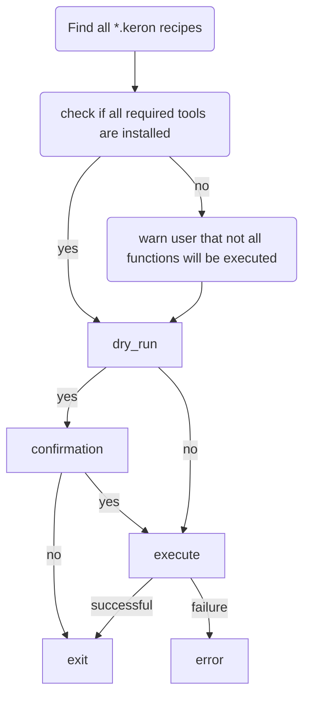

# keron

A [keron](https://stargate.fandom.com/wiki/Keron) an energy particle and part of the individual building blocks of [Replicators](https://stargate.fandom.com/wiki/Replicator) in the Stargate universe.

Keron is an opinionated dotfile manager which only does symlinks.

## Architecture

